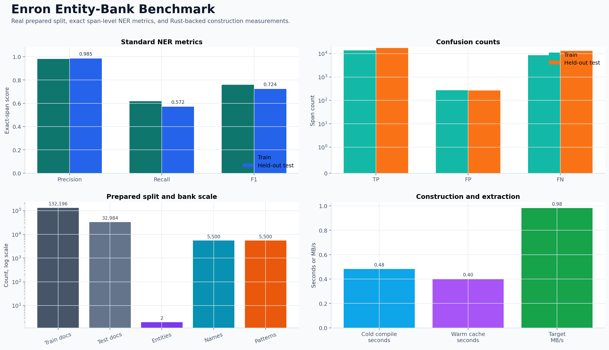
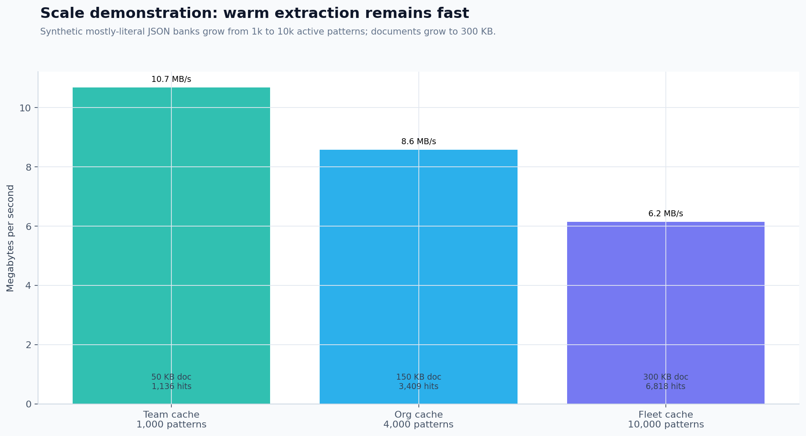

# Named Entity Regex Builder

<section class="nerb-hero" markdown="1">
<div markdown="1">

NERB is a Python package, CLI, and MCP server for curated named-entity banks. Define known entities once, validate them
before use, scan text locally with the Rust-backed engine, and return byte-offset JSON records that agents and services
can cite, patch, diff, evaluate, and promote.

```shell
pip install --upgrade nerb
nerb validate-bank --bank company.json
nerb extract-text --bank company.json --text "Send this to Acme Corp today."
```

<p class="nerb-actions" markdown="span">
[Quickstart](quickstart.md){ .md-button .md-button--primary }
[Schema](schemas.md){ .md-button }
[Performance](performance.md){ .md-button }
</p>

</div>
<figure markdown="span">
  
  <figcaption>Real benchmark output from the Enron-backed quality and performance workflow.</figcaption>
</figure>
</section>

Text summary for the benchmark image: the Enron held-out test measured 1,000 documents, 17,806 predicted records,
0.985 precision, 0.536 recall, and 0.724 micro F1. The same benchmark used a 5,500-pattern literal bank and verified a
warm compile-cache hit with 651.29 target documents per second.

## Why Teams Use NERB

<div class="nerb-card-grid" markdown="1">
<article markdown="1">

### Known Entities

Use curated names, aliases, domains, codes, accounts, products, vendors, people, or compliance terms when open-domain NER
is not the right control surface.

</article>
<article markdown="1">

### Deterministic Records

Get stable entity IDs, canonical names, matched strings, and byte offsets for evidence-backed reports, redaction, diffs,
evals, and CI gates.

</article>
<article markdown="1">

### One Local Surface

Run the same bank through Python helpers, shell commands, and local MCP tools without sending documents to a hosted model
or rewriting extraction logic.

</article>
</div>

## Complete Core Loop

Create a minimal JSON bank:

```json title="company.json"
{
  "schema_version": "nerb.bank.v1",
  "id": "company_entities",
  "name": "Company Entities",
  "description": "Companies to recognize in internal documents.",
  "version": "2026.06.24",
  "status": "active",
  "created_at": "2026-06-24T00:00:00Z",
  "updated_at": "2026-06-24T00:00:00Z",
  "unicode_normalization": "none",
  "default_regex_flags": ["IGNORECASE"],
  "entities": {
    "company": {
      "description": "Organizations.",
      "status": "active",
      "regex_flags": [],
      "names": {
        "acme_corp": {
          "canonical": "Acme Corp",
          "description": "Primary account.",
          "status": "active",
          "patterns": {
            "primary": {
              "kind": "literal",
              "value": "Acme Corp",
              "description": "Exact company alias.",
              "status": "active",
              "priority": 100,
              "case_sensitive": false,
              "normalize_whitespace": true,
              "left_boundary": "word",
              "right_boundary": "word",
              "metadata": {}
            }
          },
          "metadata": {}
        }
      },
      "metadata": {}
    }
  },
  "metadata": {}
}
```

Validate and scan:

```shell
nerb validate-bank --bank company.json
nerb extract-text --bank company.json --text "Send this to Acme Corp today."
```

NERB returns deterministic JSON records:

```json
{
  "records": [
    {
      "entity": "company",
      "canonical_name": "Acme Corp",
      "surface_name": "Acme Corp",
      "string": "Acme Corp",
      "start": 13,
      "end": 22,
      "offset_unit": "byte",
      "entity_id": "company",
      "name_id": "acme_corp",
      "pattern_id": "primary",
      "pattern_kind": "literal",
      "captures": {}
    }
  ]
}
```

## Choose Your Path

<div class="nerb-link-grid" markdown="1">
[Quickstart](quickstart.md)
: Install NERB, validate a bank, extract from text, and call the Python helper.

[Workflows](workflows.md)
: Build, validate, patch, diff, evaluate, benchmark, and regress entity banks.

[Interfaces](interfaces.md)
: Map the same extraction behavior across CLI commands, Python helpers, and MCP tools.

[Anonymization](anonymization.md)
: Replace entities with stable redaction tokens or pseudonyms and restore reversible DBs intentionally.

[Schema Reference](schemas.md)
: Read the JSON bank, extraction record, eval, replacement DB, and diagnostic contracts.

[Performance](performance.md)
: Reproduce the Rust-backed gate evidence and understand cache, compile, and scan behavior.
</div>

## When NERB Fits

| Use NERB when you need | Prefer another tool when you need |
| --- | --- |
| Known, curated entities with reviewable aliases | Open-domain entity discovery |
| Local processing for sensitive documents | Hosted extraction or human annotation workflows |
| Stable byte offsets and source IDs | Probabilistic labels without record contracts |
| CI gates for bank changes | One-off exploratory extraction with no promotion path |

## Performance Evidence

<figure markdown="span" class="nerb-wide-figure">
  
  <figcaption>Scale throughput evidence from the current Rust-backed extraction path.</figcaption>
</figure>

| Workload | Patterns | Scan/project median | Throughput |
| --- | ---: | ---: | ---: |
| Medium production bank | 8,000 | 0.008654s | 11.6 MB/s |
| 1 MB evidence run | 8,000 | 0.043692s | 22.9 MB/s |

The scale chart compares three synthetic banks: 1,000 patterns over 49,983 document bytes at 10.68 MB/s, 4,000 patterns
over 149,995 bytes at 8.59 MB/s, and 10,000 patterns over 299,991 bytes at 6.15 MB/s. The corresponding record counts
were 1,136, 3,409, and 6,818.

Reproduce the gate with:

```shell
uv run python scripts/rust_engine_gate_report.py --iterations 5 --target-bytes 100000 --dense-bytes 512 \
  --bank-owner-entity-count 1000 \
  --bank-owner-growth-entity-count 1000 \
  --bank-owner-note "representative synthetic medium bank target"
```

See [Performance And Scale Evidence](performance.md) for the full report context.
