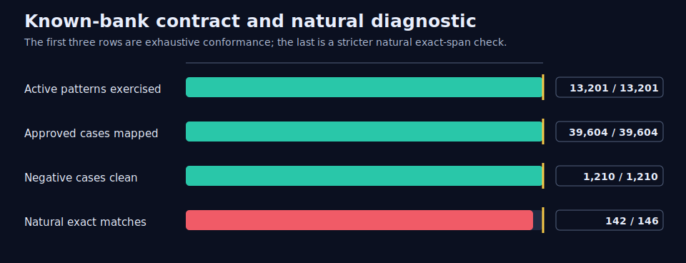
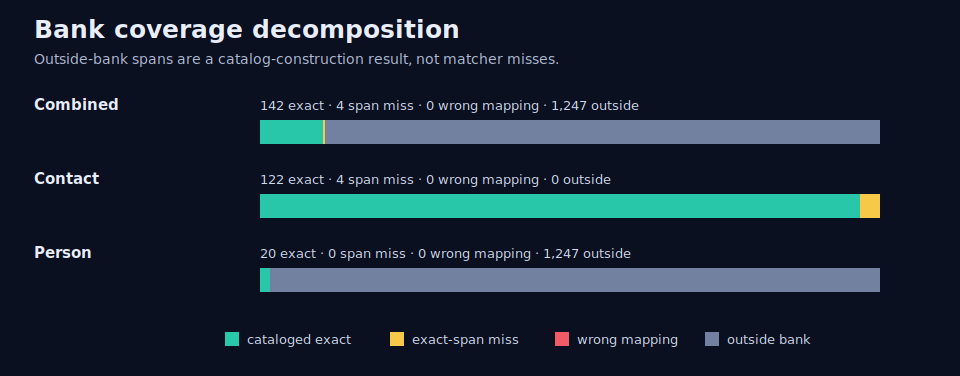
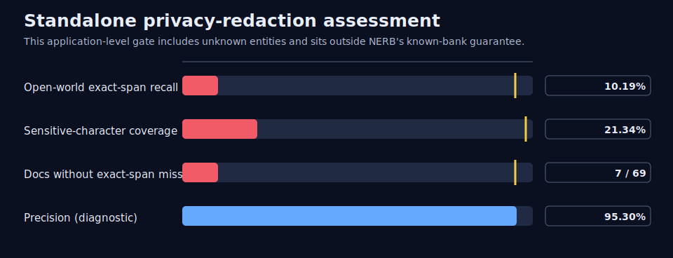

# NERB Enron evidence

**Known-bank contract evidence: PASS.** NERB detected and correctly mapped 39,604 approved cases across all 13,201 active patterns. It produced 0 wrong canonical mappings and 0 unexpected matches on 1,210 required negative and adversarial cases.

This is the contract NERB is built to make: given the same validated bank, engine, scan options, and input bytes, qualifying occurrences are detected and mapped under the bank's declared normalization, boundary, priority, and overlap semantics. It is not a guarantee to discover entities absent from the bank.

**Separate application result: NOT ELIGIBLE for standalone PII redaction.** The frozen audit found that this constructed bank cataloged only 146 of 1,393 independently labeled spans. That result limits this bank's use as a comprehensive redactor; it does not control whether the NERB package can be released.

The source corpus is public. This bundle remains aggregate-only so the same publication boundary works for private organizational sources: it contains no source text, bank values, document IDs, span surfaces, or private paths.

## 1. Known-bank contract

| Contract evidence | Result |
|---|---:|
| Active patterns exercised | 13,201 / 13,201 |
| Approved positives detected and mapped | 39,604 / 39,604 |
| Required negative/adversarial cases without unexpected matches | 1,210 / 1,210 |
| Wrong canonical mappings | 0 |

The independent natural-text panel adds a stricter exact-span, class, and canonical-mapping diagnostic. It found 142 of 146 catalog-qualified occurrences exactly (97.26%), with 4 contact exact-span evaluation misses and zero wrong canonical mappings. Person occurrences were 20/20; contacts were 122/126. The contact slice still covered 100% of sensitive characters, so exact-span record recall and character coverage answer different questions.



## 2. Bank coverage, outside the guarantee

Catalog coverage asks how much of the independently labeled population the constructed bank knew before scanning. Open-world recall counts every labeled span, including entities absent from the bank. Neither is matcher recall.

| Class | All gold | Cataloged | Outside bank | Catalog coverage |
|---|---:|---:|---:|---:|
| Combined | 1,393 | 146 | 1,247 | 10.48% |
| Contact | 126 | 126 | 0 | 100.00% |
| Person | 1,267 | 20 | 1,247 | 1.58% |

Of the 1,251 exact-span misses, 1,247 were person mentions outside the bank and four were catalog-qualified contact diagnostics.



## 3. Standalone privacy-redaction assessment

The preregistered application gate deliberately asked a broader question: could this bank, by itself, redact all in-scope person and contact PII? It could not. These frozen results remain important when someone wants that application, but they are not part of NERB's known-bank guarantee.

| Application metric | Combined | Contact | Person | Frozen requirement |
|---|---:|---:|---:|---:|
| Open-world recall | 10.19% | 96.83% | 1.58% | ≥95% |
| Catalog coverage | 10.48% | 100.00% | 1.58% | ≥80% |
| Cataloged exact-span recall | 97.26% | 96.83% | 100.00% | 100% |
| Sensitive-character recall | 21.34% | 100.00% | 2.19% | ≥98% |
| Document leakage | 89.86% | 9.38% | 96.72% | ≤5% |
| Sensitive-character leakage | 78.66% | 0.00% | 97.81% | ≤2% |
| Precision | 95.30% | 95.31% | 95.24% | diagnostic |
| Over-redaction | 0.04% | 0.04% | 0.00% | ≤5% |



## 4. Scale and reuse

The evaluated 13,201-pattern bank scanned the 100-document throughput input in a median 0.699 ms (143,057.2 documents/s). Per-document direct-scan latency was 9.021 µs median and 55.250 µs p95. Cold compilation took 7.792 s. At 100,000 patterns, throughput remained 6,810.8 documents/s on the recorded Apple M4 environment.


The value mechanism is compile once, scan many: curated aliases map detected text to canonical entity metadata, while the compiled bank is reused across messages. Applications decide which entities must be in the bank; comprehensive redaction additionally requires independently validated population coverage.

## 5. Scope and provenance

- Public source rows: 517,401; prepared records: 517,179.
- Sealed test frame: 51,704 documents; independently annotated panel: 100 documents, 1,393 spans, and 31 exhaustive negatives.
- Candidate funnel: 82,173 candidates to 13,201 active patterns.
- Full-source capacity gates: passed; performance decision-grade gates: passed.
- Frozen measurement commit: `f574b79caaf194f17ba8b8113939bd22c9380bc3`; bank: `sha256:9e67747f90873fb6f2cd1bb52afa1cb9e882d6004708d7c22fa4ca08551af84d`.

The 100 documents were selected by the preregistered deterministic stratified design from the 51,704-document frame. The result is decision-grade for the frozen panel, not a census, iid estimate, or rare-class prevalence claim. No tuning, resampling, re-annotation, or rescoring followed sealed access.

## Reproduce

```console
uv run nerb verify-enron-evidence --bundle evidence/enron
uv run nerb render-enron-evidence --bundle evidence/enron --output-dir /tmp/nerb-enron-render
```

Use `--require-standalone-redaction-eligible` only when a workflow requires this particular bank to qualify as a comprehensive standalone privacy redactor. This bundle verifies as authentic evidence, while that application-specific check fails by design.
