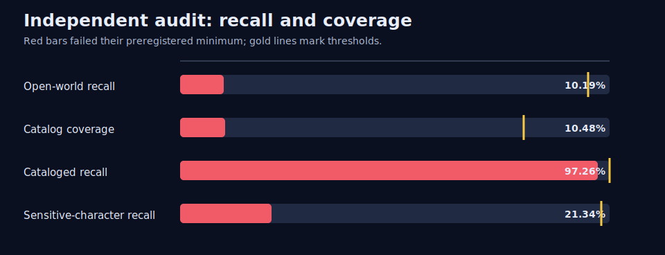
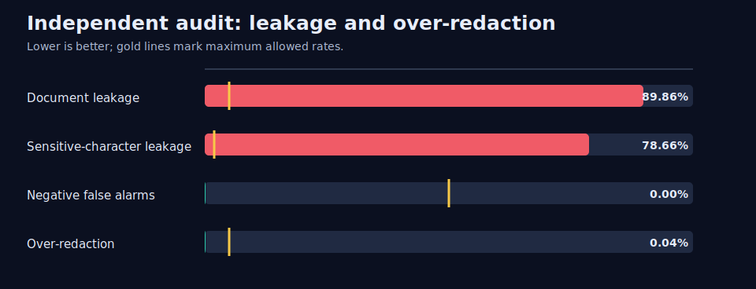
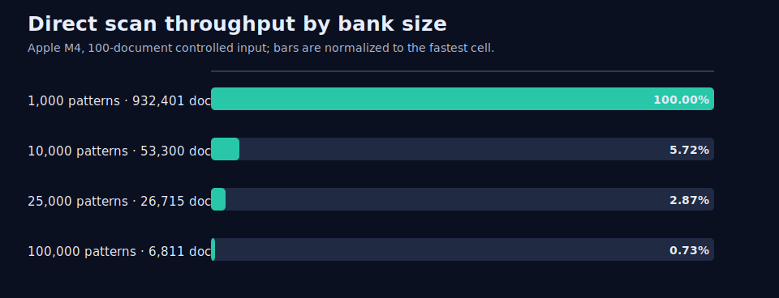

# Enron benchmark decision

**Release decision: DO NOT SHIP.** The evaluated bank is not safe for privacy redaction: its independent 100-document audit found 1,251 missed sensitive spans in 62 documents. Passing performance and capacity checks does not override failed quality gates.

The source corpus is public. This committed bundle nevertheless contains aggregate evidence only—no source text, entity-bank values, document IDs, span surfaces, or private paths.

## Practical quality scorecard

| Metric | Combined | Contact | Person | Required |
|---|---:|---:|---:|---:|
| Open-world recall | 10.19% | 96.83% | 1.58% | ≥95% |
| Catalog coverage | 10.48% | 100.00% | 1.58% | ≥80% |
| Cataloged recall | 97.26% | 96.83% | 100.00% | 100% |
| Sensitive-character recall | 21.34% | 100.00% | 2.19% | ≥98% |
| Document leakage | 89.86% | 9.38% | 96.72% | ≤5% |
| Sensitive-character leakage | 78.66% | 0.00% | 97.81% | ≤2% |
| Precision | 95.30% | 95.31% | 95.24% | diagnostic |
| Over-redaction | 0.04% | 0.04% | 0.00% | ≤5% |

Exact catalog conformance passed all 13,201 active patterns on 39,604 approved positive cases, but the independent audit still found 4 cataloged misses. Conformance proves pattern mechanics; it does not prove open-world coverage or occurrence-level recall.





## Scale and reuse

The evaluated 13,201-pattern bank scanned the 100-document throughput input in a median 0.699 ms (143,057.2 documents/s). Per-document direct-scan latency was 9.021 µs median and 55.250 µs p95. Cold compilation took 7.792 s. At 100,000 patterns, throughput remained 6,810.8 documents/s on the recorded Apple M4 environment.



The value mechanism is compile once, scan many: curated aliases map detected text to canonical entity metadata, while the compiled bank is reused across messages. This is useful only when the curated bank covers the sensitive population; this bank did not.

## Scope and provenance

- Public source rows: 517,401; prepared records: 517,179.
- Sealed test frame: 51,704 documents; independently annotated panel: 100 documents, 1,393 spans, and 31 exhaustive negatives.
- Candidate funnel: 82,173 candidates to 13,201 active patterns.
- Full-source capacity gates: passed; performance decision-grade gates: passed.
- Frozen measurement commit: `f574b79caaf194f17ba8b8113939bd22c9380bc3`; bank: `sha256:9e67747f90873fb6f2cd1bb52afa1cb9e882d6004708d7c22fa4ca08551af84d`.

The 100 documents were selected by the preregistered deterministic stratified design from the 51,704-document frame. The result is decision-grade for the frozen panel, not a census, iid estimate, or rare-class prevalence claim. No tuning, resampling, re-annotation, or rescoring followed sealed access.

## Reproduce

```console
uv run nerb verify-enron-evidence --bundle evidence/enron
uv run nerb render-enron-evidence --bundle evidence/enron --output-dir /tmp/nerb-enron-render
```

Use `--require-quality-eligible` when a workflow must fail unless the bank is releasable. This bundle verifies successfully as authentic terminal evidence, but that stricter check fails by design.
